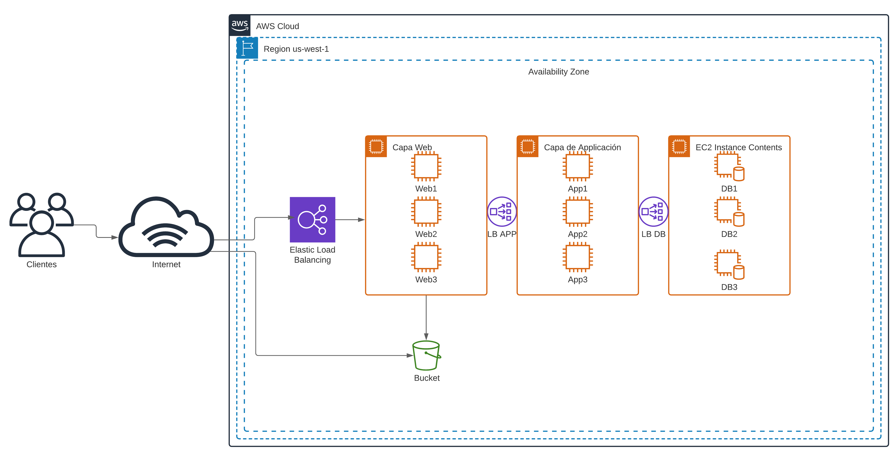

== Capítulo 2. Caso de estudio

A través de este libro estaremos creando los bloques necesarios para mantener la operación de una aplicación mantenida en la nube, la cual cuenta con varios elementos de infraestructura que definiremos como código. La idea de este caso de estudio, será que podamos desplegar esta aplicación, modificarla, escalarla, decomisarla, cambiarla de una región a otra, etc.

El caso de estudio será de la empresa imaginaria de repostería "Galletería Carlota" la cual mantiene su sistema de tienda en linea en la *_Amazon Web Service_* o *_AWS_* como le llamaremos de aquí en adelante. La arquitectura propuesta para la aplicación tiene varias capas o niveles como se muestra en la siguiente figura:

* Tres (3) Balanceador de Carga nativos de _AWS_ para la capas de presentación, aplicación y base de datos.
* Una *Capa de Presentación _web_* que permite ser escalada verticalmente.
* Las imágenes de los productos a vender serán almacenadas en un _S3 Bucket_.
* Una *Capa de Aplicación* que será donde se procese la logíca de negocio la cual tambien debe ser verticalmente escalable.
* Una *Capa de Base de Datos*, la cual es nativa a la nube y permite ser escalada verticalmente, en este caso usaremos _CoackroachDB_.

.Arquitectura de la Aplicación en AWS

