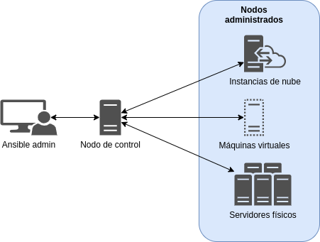

== Capítulo 5. Introducción a Ansible

*Ansible* es una herramienta de automatización que busca la simplicidad y facilidad de uso como objetivos primordiales.
Con ella se pueden configurar sistemas, administrar paquetes y, de forma avanzada, orquestar tareas que apoyen el ciclo de entrega contínua.

Ansible puede operar en dos capas separadas:

* Control Plane (_On Cloud_)
** Generar instancias y administrar sus recursos.
* On Instance
** Iniciar y detener servicios, empujar archivos de configuración, instalar paquetes, etc.

A través de https://www.openssh.com/[OpenSSH], y sin la necesidad de instalación de algún agente, ansible puede administrar los sistemas y realizar las tareas descritas anteriormente.

[NOTE]
====
*Ansible* está escrito en Python, compatible con Python 2 (versión 2.7) ó Python 3 (versiones 3.5 y superiores), requerido para su ejecución en el _nodo de control_ únicamente.
====

== Casos de uso

El enfoque de los casos de uso de ansible trata de la automatización de los procesos, los más utilizados son:

. Provisionamiento
. Administración de configuraciones
. Despliegue de aplicaciones
. Entrega contínua
. Seguridad y cumplimiento de normas (_compliance_)
. Orquestación

== Conceptos básicos

* *Tasks*: una tarea es la unidad de trabajo más pequeña.
Puede ser una acción como _Instala una base de datos_, _instala un servidor web_  o _copia este archivo de configuración al servidor_.
* *Plays*: una jugada está compuesta de varias tareas. Por ejemplo, la jugada: _Prepara una base de datos para un servicio web_, podría estar compuesta de las tareas:
** Instalar el paquete de la base de datos.
** Establecer la contraseña para el administrador de la base de datos.
** Crear la base de datos.
** Definir el acceso a la base de datos.
* *Playbook*: un playbook está compuesto de varias jugadas. Por ejemplo, en el playbook: _Instalar sitio web con backend en base de datos_, las jugadas serían:
** Configurar servidor de base de datos.
** Configurar servidor web.

=== Nodo de Control y Nodo Administrado

El proceso de automatización de tareas con ansible, requiere de la definición de *dos* tipos de nodos.
El *nodo de control* es la máquina desde donde se ejecuta ansible y los *nodo administrados* son las máquinas donde se realizaran las tareas.

[#img-ansible-nodes]
.Diagrama de nodos de ansible

== Instalación

Los pre-requisitos para la instalación de ansible son mínimos y diferentes para cada tipo de nodo.

Para el _nodo de control_, se puede utilizar cualquier máquina con Python 2 (versión 2.7) o Python 3 (versiones 3.5 o mayores) instalado.
Ansible, como paquete, sólo se instala en el _nodo de control_.

[WARNING]
====
* Algunos plugins pueden tener requerimientos adicionales.
Estos requerimientos están listados en la documentación del plugin.
====

Ansible realiza una conexión por SSH y transfiere los modulos usando SFTP.
Si SSH funciona pero SFTP no está disponible en algún _nodo administrado_, se puede modificar la configuración para utilizar SCP.
Los _nodos administrados_ requieren ejecutar Python: Python 2 (versión 2.6 o posterior) o Python 3 (versión 3.5 o posterior).

[WARNING]
====
* Algunos modulos pueden tener requerimientos adicionales que necesiten ser satisfechos en la máquina _objetivo_(nodos administrados).
Estos requerimientos están listados en la documentación del modulo.
====

=== Instalando Ansible con `*pip*`

Ansible puede instalarse en muchos sistemas con `pip`, el administrador de paquetes de Python.

Si `pip` no está instalado, ejecuta el siguiente comando para instalarlo:

----
$ curl https://bootstrap.pypa.io/get-pip.py -o get-pip.py
$ python get-pip.py --user
----

Para instalar ansible con `pip` ejecuta:

----
$ python -m pip install --user ansible
----

Para instalarlo de forma global en el sistema, se requiere ejecutar los mismos comandos con privilegios de administrador:

----
$ sudo python get-pip.py
$ sudo python -m pip install ansible
----

=== Instalando Ansible en GNU/Linux

* *RHEL/CentOS/Fedora*
----
sudo dnf install ansible
----
* *Ubuntu*
----
$ sudo apt update
$ sudo apt install software-properties-common
$ sudo apt-add-repository --yes --update ppa:ansible/ansible
$ sudo apt install ansible
----
* *Debian*
Agrega la siguiente línea al archivo `/etc/apt/sources.list`:
----
deb http://ppa.launchpad.net/ansible/ansible/ubuntu trusty main
----
Ejecuta los comandos:
----
$ sudo apt-key adv --keyserver keyserver.ubuntu.com --recv-keys 93C4A3FD7BB9C367
$ sudo apt update
$ sudo apt install ansible
----

[NOTE]
====
* Para otros sistemas operativos, consulta la  _Installation Guide_ de la _Documentación Comunitaria_ de *Ansible* en https://docs.ansible.com/ansible/latest/installation_guide/intro_installation.html#installing-ansible-on-specific-operating-systems
====

== Primeros Pasos

=== Configurando Ansible

La configuración por _default_ de ansible la encontramos en el archivo `/etc/ansible/ansible.cfg`, pero es más recomendable crear un archivo personalizado para obtener un mejor control de nuestras tareas automatizadas.

Una de las mejores prácticas al automatizar las tareas con ansible es utilizar un *directorio de trabajo* (conocido como _workdir_) para centralizar las configuraciones de dichas tareas.

Siguiendo la filosofía https://es.wikipedia.org/wiki/Principio_KISS#:~:text=El%20principio%20KISS%20establece%20que,complejidad%20accidental%20debe%20ser%20evitada[_keep it simple_] de ansible, nuestro archivo de configuración, de inicio, solamente definiría el archivo *inventario* de nuestros nodos administrados.
Por ejemplo:

`/home/user/workdir/ansible.cfg`
----
[defaults]
inventory = inventory
----

Por _default_, ansible realizará la conexión al nodo administrado con el *usuario* que ejecuta dicho comando, el cual debe incluir la https://es.wikipedia.org/wiki/Criptograf%C3%ADa_asim%C3%A9trica[ssh-key] del nodo de control en su archivo `authorized_keys`.
En caso de que se requiera ejecutar las tareas con un usuario remoto diferente, se debe agregar el parámetro en nuestro archivo de configuración:

----
[defaults]
remote_user = root
inventory = inventory
----

[NOTE]
====
* Para más información, consulta la sección _The configuration file_ de la _Documentación Comunitaria_ de *Ansible* en https://docs.ansible.com/ansible/latest/reference_appendices/config.html#the-configuration-file
====

=== Inventario

El archivo de inventario define y agrupa los nodos administrados para su mejor manejo.
En este archivo se pueden definir, además, parámetros exclusivos para el nodo o grupo de nodos administrados.

Por ejemplo, nuestros nodos administrados son:

* 1 servidor de base de datos con ssh-key de uso único
* 5 servidores web

Nuestro archivo de inventario sería:

`/home/user/workdir/inventory`
----
[dbserver]
192.168.0.100
[dbserver:vars]
ansible_ssh_private_key_file=/home/user/workdir/id_dsa_dbserver_key

[webservers]
192.168.0.[101:105]
----

[NOTE]
====
* Para más información, consulta la sección _How to build your inventory_ de la _Documentación Comunitaria_ de *Ansible* en https://docs.ansible.com/ansible/latest/user_guide/intro_inventory.html
====

=== Comandos _ad-hoc_

Los comandos _ad-hoc_ son una herramienta que se utiliza en la línea de comandos, generalmente, para automatizar tareas simples en uno o más nodos administrados.
Estos comandos permiten, de una forma sencilla, ejecutar tareas básicas:

* Verificar la conexión de todos los nodos
----
$ ansible all -m ping
----
* Reiniciar los nodos
----
$ ansible all -a "/sbin/reboot"
----
* Administrar archivos
----
$ ansible all -m ansible.builtin.copy -a "src=/etc/hosts dest=/tmp/hosts"
----
* Administrar paquetes
----
$ ansible all -m ansible.builtin.yum -a "name=mlocate state=present"
----
* Administrar usuarios y grupos
----
$ ansible webservers -m ansible.builtin.user -a "name=devel password=<contraseña>"
----
* Administrar servicios
----
$ ansible webservers -m ansible.builtin.service -a "name=httpd state=restarted"
----
* Obtener _facts_ (variables descubiertas en un sistema)
----
$ ansible all -m ansible.builtin.setup
----

[NOTE]
====
* Para más información, consulta la sección _Introduction to ad-hoc commands_ de la _Documentación Comunitaria_ de *Ansible* en https://docs.ansible.com/ansible/latest/user_guide/intro_adhoc.html
====

== Ansible Playbooks

Las tareas (_tasks_) y el conjunto de ellas (_plays_), pueden ser agrupadas dentro de un archivo que nos permita ejecutarlas de forma secuencial o incluso selectiva si lo deseamos, estos archivos son llamados *Playbooks*.

Los Playbooks son escritos en https://es.wikipedia.org/wiki/YAML[YAML], formato que por su simpleza, basada en una estructura de árbol, lo hace humanamente más legible que un archivo https://es.wikipedia.org/wiki/JSON[_JSON_] o https://es.wikipedia.org/wiki/Extensible_Markup_Language[_XML_], y con ello mantiene su ideal de ser la herramienta de implementación más sencilla.

=== Anatomía de un playbook

Un playbook, en su forma más básica, que nos revise el estado de nuestro servicio web, sería:

`check_service.yml`
----
---
- name: Ensure that {{ package }} is installed and running
  hosts: webservers

  vars:
    package: httpd

  tasks:
    - name: Verify that {{ package }} is installed in its latest version
      yum:
          name: "{{ package }}"
          state: latest
    - name: Verify that {{ package }} is running
      service:
          name: "{{ package }}"
          state: started

----

Como podemos observar, el archivo inicia con los _tres guiones_ de https://yaml.org/spec/1.2/spec.html#id2760395[YAML], para separar las directivas del contenido, para continuar con el *bloque de identificación*:

* *name*: Nombrar las _plays_ y las _tasks_ es una de las mejores prácticas recomendadas, ya que da un mejor significado al ejecutarse.
* *hosts*: Indica los _hosts_ en los que se ejecutarán las tareas, pueden estar agrupados en el archivo de inventario o puede ser su nombre de host o IP si existen en el mismo archivo.

En el siguiente bloque, *vars*, declaramos las variables a utilizar.
En nuestro ejemplo el _paquete_ a validar es *httpd* (_Apache Web Server_).

Finalmente, en el bloque de *tasks*, declaramos las tareas a ejecutar en los nodos administrados.
Nuestro ejemplo consiste de _dos_ tareas:

. Verificar que el paquete esté _instalado_, y
. Verificar que el paquete está _ejecutándose_.

Para cada una de estas tareas, hacemos uso de dos módulos diferentes, _yum_ y _service_.

Los módulos son pequeñas unidades de código que realizan las tareas utilizando instrucciones del sistema operativo, en nuestro ejemplo, para la gestión de paquetes, el módulo _yum_ utiliza el mismo comando del sistema operativo para verificar la instalación del paquete, la declaración de estado (_state_) permite a Ansible saber si debe realizar la tarea, en este mismo ejemplo, el estado debe ser _latest_, lo que significa que si el paquete está instalado en su última versión, ansible continúa con la siguiente tarea, en caso contrario realiza la tarea necesaria para obtener el estado requerido.

El módulo _service_ utiliza el comando correspondiente en el sistema operativo para asegurar que el estado del servicio sea _started_.

=== Comprueba, prueba y ejecuta

Dado que los playbooks de ansible utilizan el formato YAML, uno de los primeros tropiezos que podemos tener es una _sintaxis_ incorrecta que no permita la ejecución de nuestro playbook, esto se debe a que en el estilo de bloque YAML, la estructura está determinada por su https://yaml.org/spec/1.2/spec.html#space/indentation/[*indentación*], que utiliza espacios simples.

Para evitar este problema, el comando `ansible-playbook` nos permite realizar una revisión de ña _sintaxis_ del playbook, sin ejecutarlo.

Suponiendo que, tras escribir nuestro playbook del ejemplo anterior, nos notifican que no se puede ejecutar debido a un _error de sintaxis_; lo revisamos ejecutando:

[subs="+quotes,+macros"]
----
$ ansible-playbook *--syntax-check* check_service.yml <1>
ERROR! Syntax Error while loading YAML.
  mapping values are not allowed in this context

The error appears to be in '/home/user/workdir/check_service.yml': line 6, column 8, but may
be elsewhere in the file depending on the exact syntax problem. <2>

The offending line appears to be:

   vars:
       ^ here <3>
----
<1> El parámetro `--syntax-check` le indica al comando que únicamente valide la sintaxis del playbook.
<2> La salida nos ofrece una explicación del error de sintaxis.
<3> El mensaje de error nos muestra donde se encuentra el error de ejecución.

[WARNING]
====
* A pesar de que el mensaje de error nos muestre la ubicación del error, ésta puede ser resultado de un error anterior a la ubicación mostrada.
Lo mejor es validar que la indentación sea la correcta en las líneas anteriores al mensaje de error.
====

La salida indica la línea donde se observa el error de indentación.
Al editar el archivo, encontramos que hay un espacio _extra_ al principio de esa línea, y tras corregirlo y guardar el archivo, volvemos a ejecutar la comprobación de sintaxis:

[subs="+quotes"]
----
$ ansible-playbook *--syntax-check* check_service.yml

playbook: check_service.yml
----

Esta salida indica que nuestro playbook tiene la sintaxis correcta y podemos ejecutarlo.

Otro problema inicial muy común es que las tareas no puedan ejecutarse, no por una cuestión de sintaxis sino por alguna condición o requisito no previsto en el host, por ejemplo, que no tenga instaladas algunas dependencias necesarias por algún módulo o alguna condición en la configuración de red del host que no le permita completar la tarea.

Ante esta situación, `ansible-playbook` nos permite ejecutar el playbook en *dry-run* (_modo de pruebas_), sin realizar ningún cambio en el host; tratando de predecir el resultado de algunos de los cambios que pueden ocurrir.

Para realizar el _dry-run_, ejecutamos el comando como:

[subs="+macros"]
----
$ ansible-playbook --check check_service.yml <1>

PLAY [Ensure that httpd is installed and running] ***********************************

TASK [Gathering Facts] **************************************************************
ok: [192.168.0.101]

TASK [Verify that httpd is installed in its latest version] *************************
changed: [192.168.0.101]

TASK [Verify that httpd is running] *************************************************
changed: [192.168.0.101]

PLAY RECAP **************************************************************************
192.168.0.101 : ok=3 changed=2 unreachable=0 failed=0 skipped=0 rescued=0 ignored=0 <2>
----
<1> El parámetro `--check` le indica al comando que realice el _dry-run_ sin hacer modificaciones en los nodos administrados.
<2> No se observan errores en la ejecución del _dry-run_.

Se observa que nuestra prueba ha sido positiva y no encuentra ninguna dificultad para ejecutarse en nuestro host.

Finalmente para ejecutar nuestro playbook, lo hacemos como:

[subs="+macros"]
----
$ ansible-playbook check_service.yml

PLAY [Ensure that httpd is installed and running] ***********************************

TASK [Gathering Facts] **************************************************************
ok: [192.168.0.101]

TASK [Verify that httpd is installed in its latest version] *************************
changed: [192.168.0.101]

TASK [Verify that httpd is running] *************************************************
changed: [192.168.0.101]

PLAY RECAP **************************************************************************
192.168.0.101 : ok=3 changed=2 unreachable=0 failed=0 skipped=0 rescued=0 ignored=0 <1>
----
<1> La salida `failed=0` nos indica que las tareas concluyeron exitosamente.

Tal y como se predijo en nuestra prueba _dry-run_, nuestro playbook no tenía errores y podemos comprobarlo accediendo al host y validando la ejecución de las tareas:

[subs="+quotes"]
----
[root@webserver1 ~]# rpm -qa | grep httpd
*httpd-tools-2.4.46-10.fc34.x86_64*
*httpd-2.4.46-10.fc34.x86_64*
[root@webserver1 ~]# ps auxf | grep httpd
*root        2059  0.0  1.1  35008 11624 ?        Ss   06:58   0:00 /usr/sbin/httpd -DFOREGROUND*
apache      2060  0.0  0.7  47816  7176 ?        S    06:58   0:00  \_ /usr/sbin/httpd -DFOREGROUND
apache      2061  0.0  0.8 1236584 8860 ?        Sl   06:58   0:00  \_ /usr/sbin/httpd -DFOREGROUND
apache      2062  0.0  0.8 1105448 8864 ?        Sl   06:58   0:00  \_ /usr/sbin/httpd -DFOREGROUND
apache      2063  0.0  0.8 1105448 8864 ?        Sl   06:58   0:00  \_ /usr/sbin/httpd -DFOREGROUND
----

== {nbsp}

[role="References"]
[NOTE]
====
* Para más información, consulta la _Documentación Comunitaria_ de *Ansible* en https://docs.ansible.com/ansible_community.html
====
